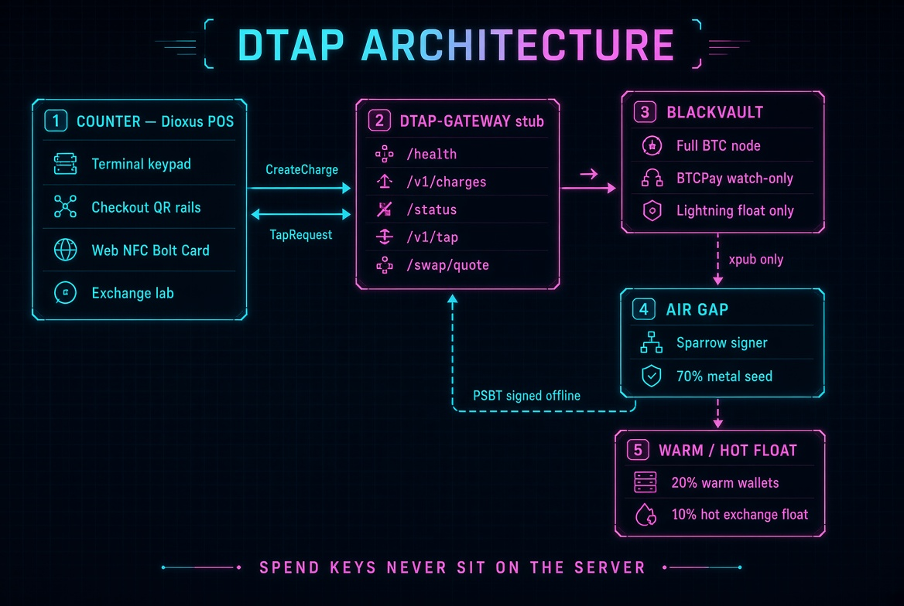
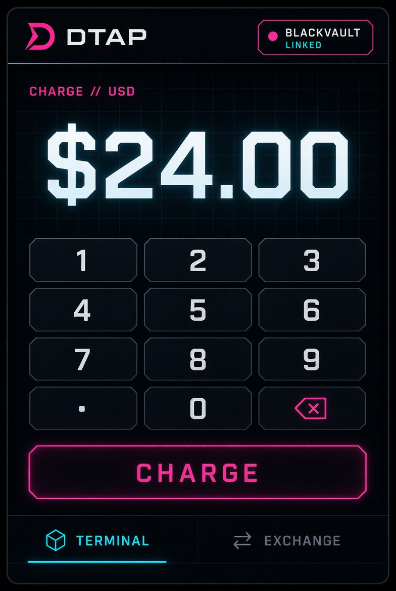
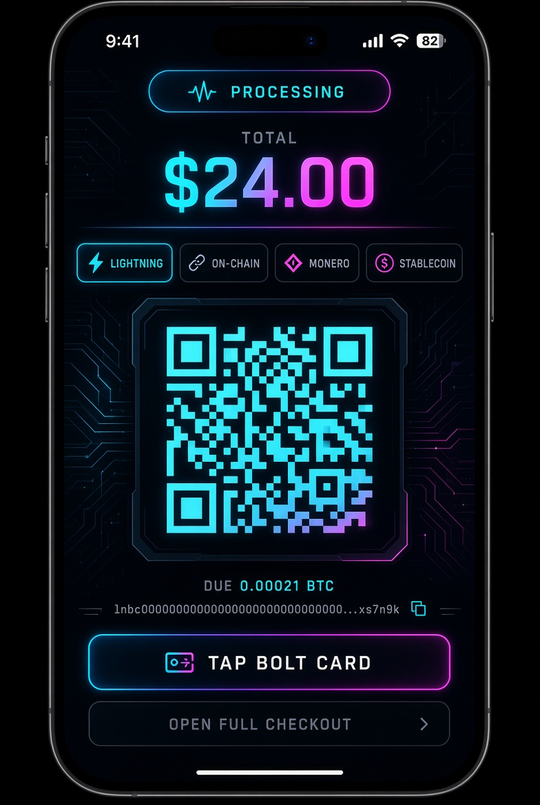

# DTap architecture

Counter app, gateway, BlackVault, air-gapped signer.

Spend keys never sit on the server. BlackVault holds the BTCPay watch-only descriptor. Sparrow signs PSBTs offline.

## Mobile counter

